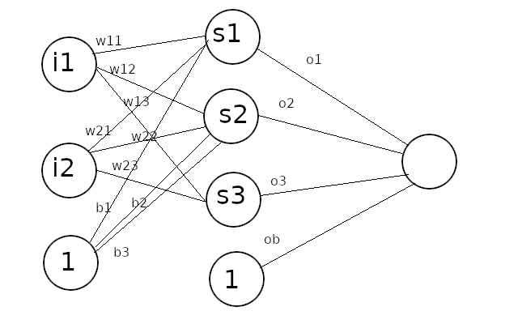

# Introduction

XOR example is a toy problem in machine learning community, a hello world for introducing neural networks. It means you have to build and train the neural network so that given 2 inputs it will output what a XOR function would output (at least close to it). This isn't math heavy explanatory tutorial, there are plenty of them out there. I assume you have some vague knowledge of neural networks and try to write a simple one. This article is just a bunch of simple python scripts that implement neural networks. No numpy or other libraries are used, so they should be easily translatable to other languages.

All the scripts use stochastic gradient descent to train the neural network, one data row at a time, so no need for matrix tranpositions. The loss function is mean squared error.

# First script

This is the simplest script, an implementation of . 

Here the neural network is just a bunch of loosely written variables.

```python runnable
import random
import math

VARIANCE_W = 0.5
VARIANCE_B = 0.1
w11 = random.uniform(-VARIANCE_W,VARIANCE_W)
w21 = random.uniform(-VARIANCE_W,VARIANCE_W)
b1 = random.uniform(-VARIANCE_B,VARIANCE_B)

w12 = random.uniform(-VARIANCE_W,VARIANCE_W)
w22 = random.uniform(-VARIANCE_W,VARIANCE_W)
b2 = random.uniform(-VARIANCE_B,VARIANCE_B)

w13 = random.uniform(-VARIANCE_W,VARIANCE_W)
w23 = random.uniform(-VARIANCE_W,VARIANCE_W)
b3 = random.uniform(-VARIANCE_B,VARIANCE_B)

o1 = random.uniform(-VARIANCE_W,VARIANCE_W)
o2 = random.uniform(-VARIANCE_W,VARIANCE_W)
o3 = random.uniform(-VARIANCE_W,VARIANCE_W)
ob = random.uniform(-VARIANCE_B,VARIANCE_B)


def sigmoid(x):
    return 1.0 / (1.0 + math.exp(-x))


def sigmoid_prime(x): # x already sigmoided
    return x * (1 - x)


def predict(i1,i2):    
    s1 = w11 * i1 + w21 * i2 + b1
    s1 = sigmoid(s1)
    s2 = w12 * i1 + w22 * i2 + b2
    s2 = sigmoid(s2)
    s3 = w13 * i1 + w23 * i2 + b3
    s3 = sigmoid(s3)
    
    output = s1 * o1 + s2 * o2 + s3 * o3 + ob
    output = sigmoid(output)
    
    return output


def learn(i1,i2,target, alpha=0.2):
    global w11,w21,b1,w12,w22,b2,w13,w23,b3
    global o1,o2,o3,ob
    
    s1 = w11 * i1 + w21 * i2 + b1
    s1 = sigmoid(s1)
    s2 = w12 * i1 + w22 * i2 + b2
    s2 = sigmoid(s2)
    s3 = w13 * i1 + w23 * i2 + b3
    s3 = sigmoid(s3)
    
    output = s1 * o1 + s2 * o2 + s3 * o3 + ob
    output = sigmoid(output)
    
    error = target - output
    derror = error * sigmoid_prime(output)
    
    ds1 = derror * o1 * sigmoid_prime(s1)
    ds2 = derror * o2 * sigmoid_prime(s2)
    ds3 = derror * o3 * sigmoid_prime(s3)
    
    o1 += alpha * s1 * derror
    o2 += alpha * s2 * derror
    o3 += alpha * s3 * derror
    ob += alpha * derror
    
    w11 += alpha * i1 * ds1
    w21 += alpha * i2 * ds1
    b1 += alpha * ds1
    w12 += alpha * i1 * ds2
    w22 += alpha * i2 * ds2
    b2 += alpha * ds2
    w13 += alpha * i1 * ds3
    w23 += alpha * i2 * ds3
    b3 += alpha * ds3   


INPUTS = [
        [0,0],
        [0,1],
        [1,0],
        [1,1]
    ]

OUTPUTS = [
        [0],
        [1],
        [1],
        [0]
    ]


for epoch in range(1,10001):
    indexes = [0,1,2,3]
    random.shuffle(indexes)
    for j in indexes:
        learn(INPUTS[j][0],INPUTS[j][1],OUTPUTS[j][0], alpha=0.2)
    
    if epoch%1000 == 0:
        cost = 0
        for j in range(4):
            o = predict(INPUTS[j][0],INPUTS[j][1])
            cost += (OUTPUTS[j][0] - o) ** 2
        cost /= 4
        print("epoch", epoch, "mean squared error:", cost)       
        

print(0,0,predict(0,0))
print(1,0,predict(1,0))
print(0,1,predict(0,1))
print(1,1,predict(1,1))
```

Example output:

```
epoch 1000 mean squared error: 0.2499876271419115
epoch 2000 mean squared error: 0.2499688242837126
epoch 3000 mean squared error: 0.24988612392100873
epoch 4000 mean squared error: 0.24903213808270375
epoch 5000 mean squared error: 0.20392068756493792
epoch 6000 mean squared error: 0.06346297881590131
epoch 7000 mean squared error: 0.01137474589491641
epoch 8000 mean squared error: 0.005176747319816359
epoch 9000 mean squared error: 0.0031937304736529845
epoch 10000 mean squared error: 0.0022656890991194886
0 0 0.027649625886219092
1 0 0.95846511144229
0 1 0.9433905288343537
1 1 0.05803856813942385
```

Your mileage may vary. Sometimes this simple net will diverge and output for all inputs the 0.666..., or it would need more iterations to train. It's normal as it is more sensitive to starting random weights than more complex models. NN libraries suffer from that too, but they can mitigate it by smarter weights initialization. You can play around with the learning rate (alpha) or the random bounds (VARIANCE_W, VARIANCE_B).


# Second script

This one is more flexible. With HIDDEN = 3, it behaves the same as the first script.

```python runnable
import random
import math

VARIANCE_W = 0.5
VARIANCE_B = 0.1

INPUTS = 2
HIDDEN = 3
OUTPUTS = 1

hidden_weights = []
for _ in range(HIDDEN):
    hidden_weights.append([random.uniform(-VARIANCE_W,VARIANCE_W) for _ in range(INPUTS)])

hidden_bias = [random.uniform(-VARIANCE_B,VARIANCE_B) for _ in range(HIDDEN)]

def sigmoid(x):
    return 1.0 / (1.0 + math.exp(-x))


def sigmoid_prime(x): # x already sigmoided
    return x * (1 - x)

output_weights = []
for _ in range(OUTPUTS):
    output_weights.append([random.uniform(-VARIANCE_W,VARIANCE_W) for _ in range(HIDDEN)])
    
output_bias = [random.uniform(-VARIANCE_B,VARIANCE_B) for _ in range(OUTPUTS)]


def predict(inputs):
    hiddens = []
    for i in range(HIDDEN):
        hidden = 0
        for j in range(INPUTS):
            hidden += hidden_weights[i][j] * inputs[j]
        hidden = sigmoid(hidden + hidden_bias[i])
        hiddens.append(hidden)
    
    outputs = []
    for i in range(OUTPUTS):
        output = 0
        for j in range(HIDDEN):
            output += output_weights[i][j] * hiddens[j]
        output = sigmoid(output + output_bias[i])
        outputs.append(output)
    
    return output


def learn(inputs,targets,alpha=0.1):
    global hidden_weights, hidden_bias
    global output_weights, output_bias
    
    hiddens = []
    for i in range(HIDDEN):
        hidden = 0
        for j in range(INPUTS):
            hidden += hidden_weights[i][j] * inputs[j]
        hidden = sigmoid(hidden + hidden_bias[i])
        hiddens.append(hidden)
    
    outputs = []
    for i in range(OUTPUTS):
        output = 0
        for j in range(HIDDEN):
            output += output_weights[i][j] * hiddens[j]
        output = sigmoid(output + output_bias[i])
        outputs.append(output)
    
    errors = []
    for i in range(OUTPUTS):
        error = targets[i] - outputs[i]
        errors.append(error)
    
    derrors = []
    for i in range(OUTPUTS):
        derror = errors[i] * sigmoid_prime(outputs[i])
        derrors.append(derror)
    
    ds = [0] * HIDDEN
    for i in range(OUTPUTS):
        for j in range(HIDDEN):
            ds[j] += derrors[i] * output_weights[i][j] * sigmoid_prime(hiddens[j])
    
    for i in range(OUTPUTS):
        for j in range(HIDDEN):
            output_weights[i][j] += alpha * hiddens[j] * derrors[i]
        output_bias[i] += alpha * derrors[i]
    
    for i in range(HIDDEN):
        for j in range(INPUTS):
            hidden_weights[i][j] += alpha * inputs[j] * ds[i]
        hidden_bias[i] += alpha * ds[i]


inputs = [
        [0,0],
        [0,1],
        [1,0],
        [1,1]
    ]

outputs = [
        [0],
        [1],
        [1],
        [0]
    ]


for i in range(10000):
    indexes = [0,1,2,3]
    random.shuffle(indexes)
    for j in indexes:
        learn(inputs[j],outputs[j],alpha=0.2)
    
    if (i+1) % 1000 == 0:
        cost = 0
        for j in range(4):
            o = predict(inputs[j])
            cost += (outputs[j][0] - o) ** 2
        cost /= 4
        print(i+1, "mean squared error:", cost)        


print(inputs[0],predict(inputs[0]))
print(inputs[1],predict(inputs[1]))
print(inputs[2],predict(inputs[2]))
print(inputs[3],predict(inputs[3]))
```

Example output:

```
1000 mean squared error: 0.2499588972948906
2000 mean squared error: 0.24965939126451603
3000 mean squared error: 0.24005845753480698
4000 mean squared error: 0.17413835776113218
5000 mean squared error: 0.02847387001541219
6000 mean squared error: 0.007179245243490972
7000 mean squared error: 0.0037596864717737103
8000 mean squared error: 0.0024862050801342387
9000 mean squared error: 0.0018376288895168352
10000 mean squared error: 0.0014490486801108566
[0, 0] 0.032098702111815376
[0, 1] 0.9637733122087175
[1, 0] 0.9639200700462749
[1, 1] 0.046386784641615345
```
