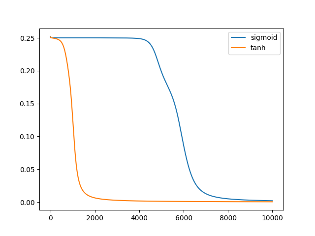

# Introduction

XOR example is a toy problem in machine learning community, a hello world for introducing neural networks. It means you have to build and train the neural network so that given 2 inputs it will output what a XOR function would output (at least close to it).

This isn't math heavy explanatory tutorial, there are plenty of them out there. Just google "neural network xor example", and you'll get for example [1](https://towardsdatascience.com/implementing-the-xor-gate-using-backpropagation-in-neural-networks-c1f255b4f20d) and [2](https://towardsdatascience.com/how-neural-networks-solve-the-xor-problem-59763136bdd7) with detailed explanation. I assume you have some vague knowledge of neural networks and try to write a simple one. This article is just a bunch of simple python scripts that implement neural networks. No numpy or other libraries are used, so they should be easily translatable to other languages.

Codingame doesn't have NN specific libraries. For Codingame people mostly train locally using NN libraries, and just copy the learned weights and implement the forward propagation themselves in their language.

All the scripts use stochastic gradient descent to train the neural network, one data row at a time, so no need for matrix tranpositions, which would be required for mini-batch. The loss function is mean squared error.


# First script

This is the simplest script, an implementation of 

Here the neural network is just a bunch of loosely written variables.

```python runnable
import random
import math

VARIANCE_W = 0.5
w11 = random.uniform(-VARIANCE_W,VARIANCE_W)
w21 = random.uniform(-VARIANCE_W,VARIANCE_W)
b1 = 0

w12 = random.uniform(-VARIANCE_W,VARIANCE_W)
w22 = random.uniform(-VARIANCE_W,VARIANCE_W)
b2 = 0

w13 = random.uniform(-VARIANCE_W,VARIANCE_W)
w23 = random.uniform(-VARIANCE_W,VARIANCE_W)
b3 = 0

o1 = random.uniform(-VARIANCE_W,VARIANCE_W)
o2 = random.uniform(-VARIANCE_W,VARIANCE_W)
o3 = random.uniform(-VARIANCE_W,VARIANCE_W)
ob = 0


def sigmoid(x):
    return 1.0 / (1.0 + math.exp(-x))


def sigmoid_prime(x): # x already sigmoided
    return x * (1 - x)


def predict(i1,i2):    
    s1 = w11 * i1 + w21 * i2 + b1
    s1 = sigmoid(s1)
    s2 = w12 * i1 + w22 * i2 + b2
    s2 = sigmoid(s2)
    s3 = w13 * i1 + w23 * i2 + b3
    s3 = sigmoid(s3)
    
    output = s1 * o1 + s2 * o2 + s3 * o3 + ob
    output = sigmoid(output)
    
    return output


def learn(i1,i2,target, alpha=0.2):
    global w11,w21,b1,w12,w22,b2,w13,w23,b3
    global o1,o2,o3,ob
    
    s1 = w11 * i1 + w21 * i2 + b1
    s1 = sigmoid(s1)
    s2 = w12 * i1 + w22 * i2 + b2
    s2 = sigmoid(s2)
    s3 = w13 * i1 + w23 * i2 + b3
    s3 = sigmoid(s3)
    
    output = s1 * o1 + s2 * o2 + s3 * o3 + ob
    output = sigmoid(output)
    
    error = target - output
    derror = error * sigmoid_prime(output)
    
    ds1 = derror * o1 * sigmoid_prime(s1)
    ds2 = derror * o2 * sigmoid_prime(s2)
    ds3 = derror * o3 * sigmoid_prime(s3)
    
    o1 += alpha * s1 * derror
    o2 += alpha * s2 * derror
    o3 += alpha * s3 * derror
    ob += alpha * derror
    
    w11 += alpha * i1 * ds1
    w21 += alpha * i2 * ds1
    b1 += alpha * ds1
    w12 += alpha * i1 * ds2
    w22 += alpha * i2 * ds2
    b2 += alpha * ds2
    w13 += alpha * i1 * ds3
    w23 += alpha * i2 * ds3
    b3 += alpha * ds3   


INPUTS = [
        [0,0],
        [0,1],
        [1,0],
        [1,1]
    ]

OUTPUTS = [
        [0],
        [1],
        [1],
        [0]
    ]


for epoch in range(1,10001):
    indexes = [0,1,2,3]
    random.shuffle(indexes)
    for j in indexes:
        learn(INPUTS[j][0],INPUTS[j][1],OUTPUTS[j][0], alpha=0.2)
    
    if epoch%1000 == 0:
        cost = 0
        for j in range(4):
            o = predict(INPUTS[j][0],INPUTS[j][1])
            cost += (OUTPUTS[j][0] - o) ** 2
        cost /= 4
        print("epoch", epoch, "mean squared error:", cost)       
        

for i in range(4):
    result = predict(INPUTS[i][0],INPUTS[i][1])
    print("for input", INPUTS[i], "expected", OUTPUTS[i][0], "predicted", f"{result:4.4}", "which is", "correct" if round(result)==OUTPUTS[i][0] else "incorrect")
```

Example output:

```
epoch 1000 mean squared error: 0.24950644703013328
epoch 2000 mean squared error: 0.21033216889786982
epoch 3000 mean squared error: 0.06970183505211733
epoch 4000 mean squared error: 0.010193355003568688
epoch 5000 mean squared error: 0.004621174723851184
epoch 6000 mean squared error: 0.002889802406873843
epoch 7000 mean squared error: 0.0020756513163735827
epoch 8000 mean squared error: 0.001609116960177383
epoch 9000 mean squared error: 0.0013089350608506563
epoch 10000 mean squared error: 0.0011005064043563537
for input [0, 0] expected 0 predicted 0.02906 which is correct
for input [0, 1] expected 1 predicted 0.9684 which is correct
for input [1, 0] expected 1 predicted 0.9684 which is correct
for input [1, 1] expected 0 predicted 0.03951 which is correct
```

Your mileage may vary. Sometimes this simple net will diverge and output for all inputs the 0.666..., or it would need more iterations to train. It's normal as it is more sensitive to starting random weights than more complex models. NN libraries suffer from that too, but they can mitigate it by smarter weights initialization ([1](https://machinelearningmastery.com/weight-initialization-for-deep-learning-neural-networks/), [2](https://towardsdatascience.com/weight-initialization-in-neural-networks-a-journey-from-the-basics-to-kaiming-954fb9b47c79), [3](https://towardsdatascience.com/weight-initialization-techniques-in-neural-networks-26c649eb3b78)).

You can play around with learning rate (alpha) and see how it affects the speed of learning. It is one of the most important hyperparameters in machine learning world. For this example, the orders of around 0.1 is used. In real world applications, 0.001, 0.0001 or even less are used, along with some decay rate. See [1](https://machinelearningmastery.com/understand-the-dynamics-of-learning-rate-on-deep-learning-neural-networks/), [2](https://www.jeremyjordan.me/nn-learning-rate/), [3](https://towardsdatascience.com/learning-rate-schedules-and-adaptive-learning-rate-methods-for-deep-learning-2c8f433990d1) for details.


# Second script

This one is more flexible. The variables are stored in array and the for loops more resemble the matrix operations. With HIDDEN = 3, it behaves the same as the first script.

```python runnable
import random
import math

VARIANCE_W = 0.5

INPUTS = 2
HIDDEN = 3
OUTPUTS = 1

hidden_weights = []
for _ in range(HIDDEN):
    hidden_weights.append([random.uniform(-VARIANCE_W,VARIANCE_W) for _ in range(INPUTS)])

hidden_bias = [0] * HIDDEN

output_weights = []
for _ in range(OUTPUTS):
    output_weights.append([random.uniform(-VARIANCE_W,VARIANCE_W) for _ in range(HIDDEN)])
    
output_bias = [0] * OUTPUTS


def sigmoid(x):
    return 1.0 / (1.0 + math.exp(-x))


def sigmoid_prime(x): # x already sigmoided
    return x * (1 - x)


def predict(inputs):
    hiddens = []
    for i in range(HIDDEN):
        hidden = 0
        for j in range(INPUTS):
            hidden += hidden_weights[i][j] * inputs[j]
        hidden = sigmoid(hidden + hidden_bias[i])
        hiddens.append(hidden)
    
    outputs = []
    for i in range(OUTPUTS):
        output = 0
        for j in range(HIDDEN):
            output += output_weights[i][j] * hiddens[j]
        output = sigmoid(output + output_bias[i])
        outputs.append(output)
    
    return output


def learn(inputs,targets,alpha=0.1):
    global hidden_weights, hidden_bias
    global output_weights, output_bias
    
    hiddens = []
    for i in range(HIDDEN):
        hidden = 0
        for j in range(INPUTS):
            hidden += hidden_weights[i][j] * inputs[j]
        hidden = sigmoid(hidden + hidden_bias[i])
        hiddens.append(hidden)
    
    outputs = []
    for i in range(OUTPUTS):
        output = 0
        for j in range(HIDDEN):
            output += output_weights[i][j] * hiddens[j]
        output = sigmoid(output + output_bias[i])
        outputs.append(output)
    
    errors = []
    for i in range(OUTPUTS):
        error = targets[i] - outputs[i]
        errors.append(error)
    
    derrors = []
    for i in range(OUTPUTS):
        derror = errors[i] * sigmoid_prime(outputs[i])
        derrors.append(derror)
    
    ds = [0] * HIDDEN
    for i in range(OUTPUTS):
        for j in range(HIDDEN):
            ds[j] += derrors[i] * output_weights[i][j] * sigmoid_prime(hiddens[j])
    
    for i in range(OUTPUTS):
        for j in range(HIDDEN):
            output_weights[i][j] += alpha * hiddens[j] * derrors[i]
        output_bias[i] += alpha * derrors[i]
    
    for i in range(HIDDEN):
        for j in range(INPUTS):
            hidden_weights[i][j] += alpha * inputs[j] * ds[i]
        hidden_bias[i] += alpha * ds[i]


inputs = [
        [0,0],
        [0,1],
        [1,0],
        [1,1]
    ]

outputs = [
        [0],
        [1],
        [1],
        [0]
    ]


for i in range(10000):
    indexes = [0,1,2,3]
    random.shuffle(indexes)
    for j in indexes:
        learn(inputs[j],outputs[j],alpha=0.2)
    
    if (i+1) % 1000 == 0:
        cost = 0
        for j in range(4):
            o = predict(inputs[j])
            cost += (outputs[j][0] - o) ** 2
        cost /= 4
        print(i+1, "mean squared error:", cost)        


for i in range(4):
    result = predict(inputs[i])
    print("for input", inputs[i], "expected", outputs[i][0], "predicted", f"{result:4.4}", "which is", "correct" if round(result)==outputs[i][0] else "incorrect")
```

Example output:

```
1000 mean squared error: 0.25001130384302916
2000 mean squared error: 0.24998178999223236
3000 mean squared error: 0.2498882299395278
4000 mean squared error: 0.2487285310117196
5000 mean squared error: 0.19301651904542888
6000 mean squared error: 0.06884957172680736
7000 mean squared error: 0.011780981900514784
8000 mean squared error: 0.005242561964051928
9000 mean squared error: 0.0032150923746817523
10000 mean squared error: 0.0022766661560815666
for input [0, 0] expected 0 predicted 0.02494 which is correct
for input [0, 1] expected 1 predicted 0.9528 which is correct
for input [1, 0] expected 1 predicted 0.9563 which is correct
for input [1, 1] expected 0 predicted 0.06596 which is correct
```

You can play around with the number of hidden units.


# Third script

This one is exactly as second script, except the activation function for hidden layer is tanh, instead of sigmoid. Also, sigmoid_prime is replaced by tanh_prime in hidden layer during training.

```python runnable
import random
import math

VARIANCE_W = 0.5

INPUTS = 2
HIDDEN = 3
OUTPUTS = 1

hidden_weights = []
for _ in range(HIDDEN):
    hidden_weights.append([random.uniform(-VARIANCE_W,VARIANCE_W) for _ in range(INPUTS)])

hidden_bias = [0] * HIDDEN

output_weights = []
for _ in range(OUTPUTS):
    output_weights.append([random.uniform(-VARIANCE_W,VARIANCE_W) for _ in range(HIDDEN)])
    
output_bias = [0] * OUTPUTS


def sigmoid(x):
    return 1.0 / (1.0 + math.exp(-x))


def sigmoid_prime(x): # x already sigmoided
    return x * (1 - x)


def tanh(x):
    return math.tanh(x)


def tanh_prime(x): # x already tanhed
    return 1 - x * x


def predict(inputs):
    hiddens = []
    for i in range(HIDDEN):
        hidden = 0
        for j in range(INPUTS):
            hidden += hidden_weights[i][j] * inputs[j]
        hidden = tanh(hidden + hidden_bias[i])
        hiddens.append(hidden)
    
    outputs = []
    for i in range(OUTPUTS):
        output = 0
        for j in range(HIDDEN):
            output += output_weights[i][j] * hiddens[j]
        output = sigmoid(output + output_bias[i])
        outputs.append(output)
    
    return output


def learn(inputs,targets,alpha=0.1):
    global hidden_weights, hidden_bias
    global output_weights, output_bias
    
    hiddens = []
    for i in range(HIDDEN):
        hidden = 0
        for j in range(INPUTS):
            hidden += hidden_weights[i][j] * inputs[j]
        hidden = tanh(hidden + hidden_bias[i])
        hiddens.append(hidden)
    
    outputs = []
    for i in range(OUTPUTS):
        output = 0
        for j in range(HIDDEN):
            output += output_weights[i][j] * hiddens[j]
        output = sigmoid(output + output_bias[i])
        outputs.append(output)
    
    errors = []
    for i in range(OUTPUTS):
        error = targets[i] - outputs[i]
        errors.append(error)
    
    derrors = []
    for i in range(OUTPUTS):
        derror = errors[i] * sigmoid_prime(outputs[i])
        derrors.append(derror)
    
    ds = [0] * HIDDEN
    for i in range(OUTPUTS):
        for j in range(HIDDEN):
            ds[j] += derrors[i] * output_weights[i][j] * tanh_prime(hiddens[j])
    
    for i in range(OUTPUTS):
        for j in range(HIDDEN):
            output_weights[i][j] += alpha * hiddens[j] * derrors[i]
        output_bias[i] += alpha * derrors[i]
    
    for i in range(HIDDEN):
        for j in range(INPUTS):
            hidden_weights[i][j] += alpha * inputs[j] * ds[i]
        hidden_bias[i] += alpha * ds[i]


inputs = [
        [0,0],
        [0,1],
        [1,0],
        [1,1]
    ]

outputs = [
        [0],
        [1],
        [1],
        [0]
    ]


for i in range(10000):
    indexes = [0,1,2,3]
    random.shuffle(indexes)
    for j in indexes:
        learn(inputs[j],outputs[j],alpha=0.2)
    
    if (i+1) % 1000 == 0:
        cost = 0
        for j in range(4):
            o = predict(inputs[j])
            cost += (outputs[j][0] - o) ** 2
        cost /= 4
        print(i+1, "mean squared error:", cost)        


for i in range(4):
    result = predict(inputs[i])
    print("for input", inputs[i], "expected", outputs[i][0], "predicted", f"{result:4.4}", "which is", "correct" if round(result)==outputs[i][0] else "incorrect")
```

Example output:
```
1000 mean squared error: 0.0061729073060459915
2000 mean squared error: 0.0015754154512582549
3000 mean squared error: 0.0008510341785755552
4000 mean squared error: 0.0005731795112170564
5000 mean squared error: 0.00042899519927730044
6000 mean squared error: 0.0003414967710025598
7000 mean squared error: 0.0002830319449863964
8000 mean squared error: 0.00024133098714384138
9000 mean squared error: 0.00021014923444340877
10000 mean squared error: 0.0001859852279128196
for input [0, 0] expected 0 predicted 0.01346 which is correct
for input [0, 1] expected 1 predicted 0.9888 which is correct
for input [1, 0] expected 1 predicted 0.9862 which is correct
for input [1, 1] expected 0 predicted 0.01573 which is correct
```

See how faster and better it converges than only sigmoid one. 

The common choice for activation function is [relu](https://machinelearningmastery.com/rectified-linear-activation-function-for-deep-learning-neural-networks/). Has plenty advantages, but for me the most important one is speed. In game tree search, doing bunch of relus is much faster than doing bunch of tanhs.

For exercise, replace tanh and tanh_prime with relu and relu_prime accordingly and see how does it affect training. I remark that relu seems more sensitive to weights initialization, in the simplest xor example it diverges more often.

```python
def relu(x):
    return max(0,x)


def relu_prime(x):
    if x <= 0: return 0
    else: return 1
```


# Fourth script

The same as third script (tanh in hidden layer), but this time with momentum [1](https://cnl.salk.edu/~schraudo/teach/NNcourse/momrate.html) [2](https://d2l.ai/chapter_optimization/momentum.html).

```python runnable
import random
import math

VARIANCE_W = 0.5

INPUTS = 2
HIDDEN = 3
OUTPUTS = 1

hidden_weights = []
hidden_momentum = []
for _ in range(HIDDEN):
    hidden_weights.append([random.uniform(-VARIANCE_W,VARIANCE_W) for _ in range(INPUTS)])
    hidden_momentum.append([0 for _ in range(INPUTS)])

hidden_bias = [0] * HIDDEN

output_weights = []
output_momentum = []
for _ in range(OUTPUTS):
    output_weights.append([random.uniform(-VARIANCE_W,VARIANCE_W) for _ in range(HIDDEN)])
    output_momentum.append([0 for _ in range(HIDDEN)])
    
output_bias = [0] * OUTPUTS


def sigmoid(x):
    return 1.0 / (1.0 + math.exp(-x))


def sigmoid_prime(x): # x already sigmoided
    return x * (1 - x)


def tanh(x):
    return math.tanh(x)


def tanh_prime(x): # x already tanhed
    return 1 - x * x


def predict(inputs):
    hiddens = []
    for i in range(HIDDEN):
        hidden = 0
        for j in range(INPUTS):
            hidden += hidden_weights[i][j] * inputs[j]
        hidden = tanh(hidden + hidden_bias[i])
        hiddens.append(hidden)
    
    outputs = []
    for i in range(OUTPUTS):
        output = 0
        for j in range(HIDDEN):
            output += output_weights[i][j] * hiddens[j]
        output = sigmoid(output + output_bias[i])
        outputs.append(output)
    
    return output


def learn(inputs,targets,alpha=0.1,lambd=0.8):
    global hidden_weights, hidden_bias
    global output_weights, output_bias
    global hidden_momentum, output_momentum
    
    hiddens = []
    for i in range(HIDDEN):
        hidden = 0
        for j in range(INPUTS):
            hidden += hidden_weights[i][j] * inputs[j]
        hidden = tanh(hidden + hidden_bias[i])
        hiddens.append(hidden)
    
    outputs = []
    for i in range(OUTPUTS):
        output = 0
        for j in range(HIDDEN):
            output += output_weights[i][j] * hiddens[j]
        output = sigmoid(output + output_bias[i])
        outputs.append(output)
    
    errors = []
    for i in range(OUTPUTS):
        error = targets[i] - outputs[i]
        errors.append(error)
    
    derrors = []
    for i in range(OUTPUTS):
        derror = errors[i] * sigmoid_prime(outputs[i])
        derrors.append(derror)
    
    ds = [0] * HIDDEN
    for i in range(OUTPUTS):
        for j in range(HIDDEN):
            ds[j] += derrors[i] * output_weights[i][j] * tanh_prime(hiddens[j])
    
    for i in range(OUTPUTS):
        for j in range(HIDDEN):
            output_momentum[i][j] = lambd * output_momentum[i][j] + alpha * hiddens[j] * derrors[i]
            output_weights[i][j] += output_momentum[i][j]
        output_bias[i] += alpha * derrors[i]
    
    for i in range(HIDDEN):
        for j in range(INPUTS):
            hidden_momentum[i][j] = lambd * hidden_momentum[i][j] + alpha * inputs[j] * ds[i]
            hidden_weights[i][j] += hidden_momentum[i][j]
        hidden_bias[i] += alpha * ds[i]


inputs = [
        [0,0],
        [0,1],
        [1,0],
        [1,1]
    ]

outputs = [
        [0],
        [1],
        [1],
        [0]
    ]


for i in range(10000):
    indexes = [0,1,2,3]
    random.shuffle(indexes)
    for j in indexes:
        learn(inputs[j],outputs[j],alpha=0.2,lambd=0.8)
    
    if (i+1) % 1000 == 0:
        cost = 0
        for j in range(4):
            o = predict(inputs[j])
            cost += (outputs[j][0] - o) ** 2
        cost /= 4
        print(i+1, "mean squared error:", cost)        


for i in range(4):
    result = predict(inputs[i])
    print("for input", inputs[i], "expected", outputs[i][0], "predicted", f"{result:4.4}", "which is", "correct" if round(result)==outputs[i][0] else "incorrect")
```
